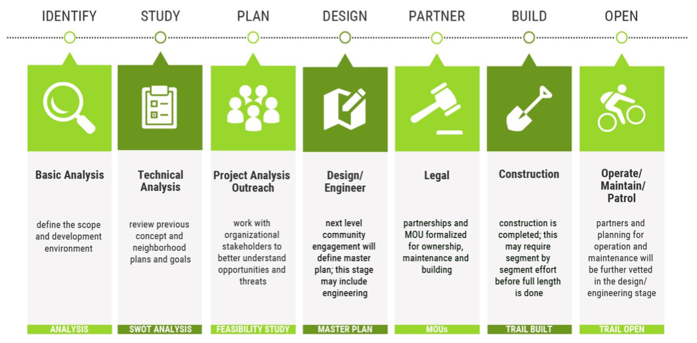

# Awesome Trail Building 
A collection of trail building resources, links, guides, tools and handbooks which help to build new, or maintain existing trails for hiking, XC Ski, equestrian, mountain biking or general use.

**Please contribute. Let's make this guide better!** Please follow the [Contributing Guidelines](https://github.com/paschmann/awesome-trail-building/blob/master/CONTRIBUTING.md). Or you can comment below this issue: [Welcome to contribute](https://github.com/paschmann/awesome-trail-building/issues/1)

Inspired by [Awesome GIS](https://github.com/sshuair/awesome-gis)

Source: [Richmond Trail Feasability Study | Rails to Trails Conservancy](https://www.railstotrails.org/wp-content/uploads/2024/02/Richmond-Industrial-Trail-Feasibility-Study-.pdf)

---

**Table Of Contents:**

  - [Trail Glossary and Definitions](#trail-definitions)

  - [Planning and Design](#trail-planning-and-design)
    - [Accesability](#accessability)
    - [Design](#design)
    - [Case Studies](#case-studies)
  
  - [Fundraising](#trail-funding-programs)

  - [Planning Tools](#trail-planning-tools)
    - [Geographic Information System Software](#mapping-and-topo-software)
    
  - [Education](#education)
    - [Books](#books)
    - [Courses](#courses)
  
  - [Trail Building](#trail-building)
    - [Complete Guides](#complete-guides)
  
  - [Trail Signage](#trail-signage)
  
  - [Trail Management](#trail-management)
    - [Maintenance](#maintenance)
    - [Management Tools](#management-tools)
  
  - [Organizations](#organizations)
    - [Non-profit](#non-profit)
    - [Advocacy Groups](#advocacy-groups)
    - [Associations](#associations)
    - [Online Communities](#online-communities)
    - [Trail Steward Groups](#trail-steward-groups)

----

##  Trail Glossary and Definitions

- [USFS: Trail Matrix - PDF](https://www.fs.usda.gov/recreation/programs/trail-management/documents/trailfundamentals/01_TrailMatrixHandout_Sec508_01-24-17_150dpi.pdf)
- [Trail Work Glossary — Washington Trails Association](https://www.wta.org/get-involved/volunteer/about-trail-work/trail-work-guide/trail-work-glossary)
- [Standardized Trail Terminology for Use in Colorado](https://cpw.state.co.us/Documents/Trails/Grants/NonMotorized/RecommendedStandardizedTrailTerms.pdf)

## Trail Planning and Design

### Accessability
- [Fundamentals of Outdoor Recreation and Trails Accessibility - PDF](https://cdn2.assets-servd.host/material-civet/production/images/documents/1223-2806P-AGORT-COL-08-20-13_Errata2Fixed_300dpi2_190413_200943.pdf?dm=1620062854)
- [USFS: Accessibility Guidebook for Outdoor Recreation and Trails](https://www.fs.usda.gov/t-d/pubs/htmlpubs/htm12232806/toc.htm)
- [U.S. Access Board: ABA Accessability Standards](https://www.access-board.gov/aba/guides/chapter-10-outdoor/)

### Design
- [USFS: Trail Fundamentals Definitions](https://www.fs.usda.gov/recreation/programs/trail-management/documents/trailfundamentals/USFS_Trail_Fundamentals_Definitions.pdf)
- [Increasing Opportunities for Access on the Appalachian Trail - PDF](https://appalachiantrail.org/wp-content/uploads/2020/05/increasing-opportunities-for-access-on-the-appalachian-trail-a-design-guide.pdf)
- [USFS: Trail Design Parameters for Hiking, Biking, etc.](https://www.fs.usda.gov/recreation/programs/trail-management/documents/trailfundamentals/03-TrailDesignParaHandout_Sec508_01-24-17_150dpi.pdf)
- [USFS: Condition Assessment Survey Matrix](https://www.fs.usda.gov/recreation/programs/trail-management/documents/trailfundamentals/04-TrailCASMHandout_Sec508_01-24-17_150dpi.pdf)
- [USFS: Standard Trail Plans and Specifications](https://www.fs.usda.gov/managing-land/trails/trail-management-tools/trailplans)
- [USFS: Sample Trail Construction Plan](https://www.fs.usda.gov/sites/default/files/sample-trail-package.pdf)
- [IMBA: IMBA's Guide to Building Sweet Singletrack Book](https://www.imba.com/resource/trail-solutions)
- [Basic Elements of Trail Design and Trail Layout - American Trails](https://www.americantrails.org/resources/basic-elements-of-trail-design-and-trail-layout)
- [Natural Surface Trails by Design](https://www.natureshape.com/pubs/nstbd.html)
- [Vermont Town Forest Trail Design Guide](https://fpr.vermont.gov/sites/fpr/files/doc_library/FPR-VT-Town-Forest-trail-design-guide.pdf)
- [Vermont Pedestrian and Bicycle Facility Planning and Design Manual](https://fpr.vermont.gov/sites/fpr/files/doc_library/VTrains-Pedestrian-and-Bicycle-Facility-Design-Manual.pdf)
- [Empire State Trail Design Guide](https://empiretrail.ny.gov/sites/default/files/2021-09/EST%20Design%20Guide%20Oct%202017_0.pdf)

### Case Studies

- [FHWA: Rails-with-Trails - Lessons Learned](https://www.fhwa.dot.gov/environment/recreational_trails/publications/rwt/)
- [Recreation Economy at USDA Economic Development Resources for Rural Communities - PDF](https://www.rd.usda.gov/sites/default/files/usdard_recreational_economy508.pdf)
- [Trail Use, Motivations, and Environmental Attitudes of 3780 European Mountain Bikers: What Is Sustainable?](https://www.mdpi.com/1660-4601/18/24/12971)
- [Richmond Trail Feasability Study | Rails to Trails Conservancy](https://www.railstotrails.org/wp-content/uploads/2024/02/Richmond-Industrial-Trail-Feasibility-Study-.pdf)

### Trail Funding Programs

- USA: Federal
    - [NPS: Land and Water Conservation Fund (U.S. National Park Service)](https://www.nps.gov/subjects/lwcf/index.htm)
    - [The Trail Fund Programs - American Trails](https://www.americantrails.org/the-trail-fund)
    - [Home | Grants.gov](https://www.grants.gov/)
    - [NPS: Rivers, Trails, and Conservation Assistance Program (U.S. National Park Service)](https://www.nps.gov/orgs/rtca/index.htm)

- North Carolina:
    - [Trail Grants | North Carolina Trails](https://trails.nc.gov/trail-grants)
    - [Parks and Recreation Trust Fund | NC State Parks](https://www.ncparks.gov/about-us/grants/parks-and-recreation-trust-fund)
    - [North Carolina Land and Water Fund | North Carolina Land and Water Fund](https://nclwf.nc.gov/)

- South Carolina:
    - [Recreational Trails Program | SCPRT](https://www.scprt.com/recreation/recreation-grant-programs/recreational-trails-program)

- Gerogia:
    - [Recreational Trails Program | Department Of Natural Resources Division](https://gadnr.org/RTP)   

## Trail Planning Tools

### Mapping and Topo Software

- [ArcGIS Desktop](https://www.esri.com/en-us/)
- [Geodata](https://data.fs.usda.gov/geodata/edw/datasets.php?dsetParent=Recreation)
- [CalTopo - Backcountry Mapping Software](https://caltopo.com/map.html#ll=35.81781,-84.83643&z=5&b=mbt)
- [Hillmap - Backcountry Maps for the Obsessed](http://www.hillmap.com/)
- [QGIS - A Free and Open Source Geographic Information System](https://www.qgis.org/en/site/)
- [United States Interagency Elevation Inventory](https://coast.noaa.gov/inventory/)

## Education

### Books

- [AMC's Complete Guide to Trail Building and Maintenance, 5th Edition - Appalachian Mountain Club Store](https://amcstore.outdoors.org/products/amcs-complete-guide-to-trail-building-and-maintenance-5th-edition)
- [Lightly on the Land: The Sca Trail Building And Maintenance Manual 2nd Edition](https://www.amazon.com/Lightly-Land-Building-Maintenance-Manual/dp/0898868483/ref=sr_1_3?crid=CO8GQUUZV64H&keywords=trail+maintenance&qid=1677876162&s=books&sprefix=trail+mantenanc%2Cstripbooks%2C187&sr=1-3)
- [Trail Construction and Maintenance Notebook](https://www.amazon.com/Construction-Maintenance-Notebook-Department-Agriculture/dp/B0B9QWDV4J/ref=sr_1_2?crid=CO8GQUUZV64H&keywords=trail+maintenance&qid=1677876162&s=books&sprefix=trail+mantenanc%2Cstripbooks%2C187&sr=1-2)
[Trail Solutions : IMBA's Guide to Building Sweet Singletrack](https://www.amazon.com/Trail-Solutions-IMBAs-Building-Singletrack/dp/0975502301/ref=asc_df_0975502301/?tag=hyprod-20&linkCode=df0&hvadid=312710253827&hvpos=&hvnetw=g&hvrand=12897669645348861468&hvpone=&hvptwo=&hvqmt=&hvdev=c&hvdvcmdl=&hvlocint=&hvlocphy=9029121&hvtargid=pla-464826264209&psc=1&tag=&ref=&adgrpid=61681020945&hvpone=&hvptwo=&hvadid=312710253827&hvpos=&hvnetw=g&hvrand=12897669645348861468&hvqmt=&hvdev=c&hvdvcmdl=&hvlocint=&hvlocphy=9029121&hvtargid=pla-464826264209)
- [Natural Surface Trails by Design](https://www.natureshape.com/pubs/nstbd.html)
- [Trail Planning, Design & Development Guidelines - American Trails](https://www.americantrails.org/resources/review-of-trail-planning-design-development-guidelines)
- [Trails Design and Management Handbook](https://www.natureshape.com/pubs/tdmh/index.html)
- [A Handbook on Trail Building and Maintenance - PDF](http://npshistory.com/publications/seki/trail-maint-bldg.pdf)
- [AASHTO: Sigange - Guide for the Development of Bicycle Facilities, 4th Edition](https://store.transportation.org/item/collectiondetail/116?AspxAutoDetectCookieSupport=1)

### Courses

- [Trail Skills College Course Curriculum - Pacific Crest Trail Association](https://www.pcta.org/volunteer/trail-skills-college/trail-skills-college-course-curriculum/)

## Trail Building

### Complete Guides

These guides are end to end design, build and maintain guides or resources.

- [USFS: Trail Construction and Maintenance Notebook](https://www.fhwa.dot.gov/environment/recreational_trails/publications/fs_publications/07232806/toc.cfm)
- [USFS: Equestrian Design Guidebook for Trails, Trailheads, and Campgrounds](https://www.fs.usda.gov/t-d/php/library_card.php?p_num=0723+2816)
- [A Handbook for Trail Design, Construction, and Maintenance - American Trails](https://www.americantrails.org/resources/a-handbook-for-trail-design-construction-and-maintenance)
- [Trail-Building Toolbox - Rails to Trails Conservancy | Rails to Trails Conservancy](https://www.railstotrails.org/trail-building-toolbox/#funding)
- [BLM: Guidelines for a Quality Trail Experience (MTB Specific)](https://www.blm.gov/sites/blm.gov/files/Guidelines-for-a-Quality-Trail-Experience-2017.pdf)
- [IMBA: Mountain Bike Trail Development Guidelines for Successfully Managing the Process](https://fpr.vermont.gov/sites/fpr/files/doc_library/IMBA-MTB-Trail-Development-Guidelines-for-successfully-managing-the-process.pdf)
- [Vermont Backcountry Ski Handbook](https://fpr.vermont.gov/sites/fpr/files/doc_library/VT-BC-HANDBOOK.pdf)
- [Recreation Trail Design - Dr. Mel Baughman - PDF](https://treefarmsystem.org/stuff/contentmgr/files/1/3d97aa7a77471fb89315137f2c6247b4/files/trail_design_for_tree_farmers.pdf)

Additional guides:

- [Six Step Method of Trail Construction | Volunteers for Outdoor Colorado](https://www.voc.org/six-step-method-of-trail-construction)
- [IMBA: Trailbuilding Basics - PDF](https://cdn2.assets-servd.host/material-civet/production/images/documents/IMBA_Trailbuilding_Basics.pdf?dm=1620062745)
- [IMBA: A Guide to Designing and Constructing Native-surface Trails - PDF](https://cdn2.assets-servd.host/material-civet/production/images/documents/Sustainable-Trail-Development-Guidelines.PDF?dm=1620062735)
- [Pathways to Trail Building - Tennessee Department of Environment and Conservation](https://www.tn.gov/content/dam/tn/environment/recreation-services/documents/pathways.pdf)
- [The Intertwine Regional Trails Signage Guidelines - Rails to Trails Conservancy](https://www.railstotrails.org/resource-library/resources/the-intertwine-regional-trails-signage-guidelines/)

## Trail Signage

- [FGDC Digital Cartographic Standard for Geologic Map Symbolization (PostScript Implementation)](https://pubs.usgs.gov/tm/2006/11A02/)
- [Effective Wayfinding Signage Trail System Planning, Design, and Implementation - YouTube](https://www.youtube.com/watch?v=_riHEBXhJcY)
- [FHWA: 2009 Manual on Uniform Traffic Control Devices](https://mutcd.fhwa.dot.gov/kno_2009r1r2.htm)
- [FHWA: Manual on Uniform Traffic Control Devices Color Specifications](https://mutcd.fhwa.dot.gov/kno-colorspec.htm)
- [Signage and Surface Markings - Rails to Trails Conservancy](https://www.railstotrails.org/trail-building-toolbox/signage-and-surface-markings/)
- [Trail Crossings - Rails to Trails Conservancy](https://www.railstotrails.org/trail-building-toolbox/crossings/)
- [Great Allegheny Passage Graphic Identity & Sign Design Guidelines](https://www.railstotrails.org/resource-library/resources/great-allegheny-passage-graphic-identity-sign-design-guidelines/)
- [WEBINAR - Trail Network Signage: Creating a Unified Brand - Rails to Trails Conservancy](https://www.railstotrails.org/resource-library/resources/webinar-trail-network-signage-creating-a-unified-brand/)

## Trail Management

### Maintenance

- [Trail Construction and Maintenance Notebook](https://www.fhwa.dot.gov/environment/recreational_trails/publications/fs_publications/07232806/toc.cfm) - Includes some nice practical articles like "The Job of a Trail Crew".
- [Superior Hiking Trail Association - Trail Maintenance Handbook - PDF](https://superiorhiking.org/wp-content/uploads/2021/04/SHTA-Trail-Maintenance-Manual-2021.pdf)
- [Rigging Handbook for Trail Work](https://www.nynjtc.org/sites/default/files/Rigging_Handbook_for_trail_work_2015.pdf)
- [Hand Tools for Trail Work - PDF](https://www.bchmt.org/documents/education/HandtoolsforTrailWork.pdf)
- [Empire State Trails - Inventory Report](https://empiretrail.ny.gov/sites/default/files/2021-09/EST%20Rehabilitation%20Report%20Jan%202020_0.pdf) - Provides a nice reference and overview of existing trails and costs to maintain.

### Management Tools
- [USFS: TRACS - PDF](https://www.fs.usda.gov/recreation/programs/trail-management/documents/TRACS/TRACS_User_Guide_05_01_2011.pdf)

- [Empire State Trails - Trail Usage Projections](https://empiretrail.ny.gov/sites/default/files/2021-09/EST%20Trail%20User%20Projections%20July%202018.pdf)

## Organizations

### Non-profit

- [Home | IMBA](https://www.imba.com/)
- [Rails to Trails Conservancy: Building A Nation Connected By Trails | Rails to Trails Conservancy](https://www.railstotrails.org/)
- [American Hiking Society - Protect the Places You Love to Hike](https://americanhiking.org/)

### Advocacy Groups

- [Home | Sierra Club](https://www.sierraclub.org/)
- [Back Country Horsemen of America](https://www.bcha.org/)
- [Appalachian Mountain Club (AMC)](https://www.outdoors.org/conservation/priorities/trail-planning-and-protection/)
- [Appalachian Trail Conservancy](https://appalachiantrail.org/)
- [Welcome to NEMBA | New England Mountain Bike Association](https://nemba.org/)
- [The Palmetto Trail – Palmetto Conservation Foundation](https://palmettoconservation.org/palmetto-trail/)
- [Foothills Trail Conservancy](https://foothillstrail.org/)
- [East Coast Greenway - Home](https://greenway.org/)
- [The Circuit Trails | Greater Philadelphia Trail Network](https://circuittrails.org/)

### Associations

- [Professional TrailBuilders Association](https://www.trailbuilders.org/)
- [Washington Trails Association](https://www.wta.org/)
- [Kansas Trails Council](https://www.kansastrailscouncil.org/)
- [Volunteer Resources – Florida Trail Association](https://floridatrail.org/volunteer-resources/)

### Online Communities

- [Reddit: r/MTBTrailBuilding - Time to get dirty](https://www.reddit.com/r/MTBTrailBuilding/)

### Trail Steward Groups

- [USA: CA: Santa Cruz Mountains Trail Stewardship](https://santacruztrails.org/)
- [USA: NC: Tarheel Trailblazers](https://tarheeltrailblazers.com/)
- [Mountains-to-Sea Trail | North Carolina](https://mountainstoseatrail.org/)